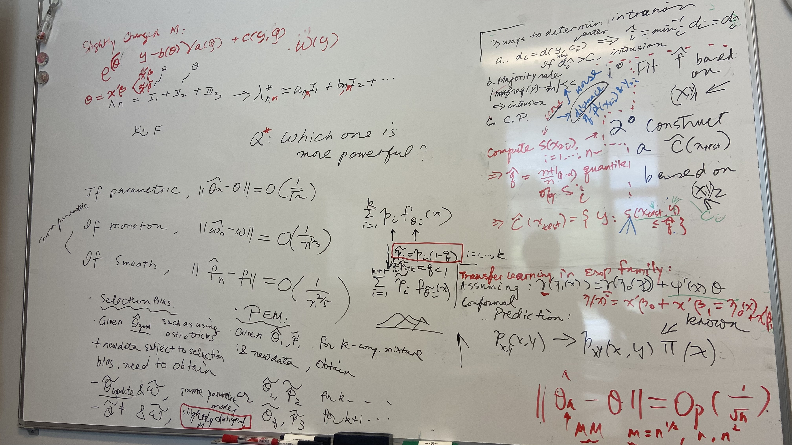

### Before
- 

### In Meeting
- relate to PEM and Data Drift 
- 
- also see [2025-02-25](2025-02-25.md)

### After
- reply to Nathan
- stability of 95% quantile of Lambda for MM+NPMLE:
	- converge when about m=n for all the exp, norm, gamma cases
- look into the convergence rate of gamma_n (line 5, p16, test2), with different choices of m:
	- 
- look into the convergence rate of theta_n, with different choices of m:
	- converge when m=n^(11/12) for normal case
	- converge when m=n^(5/6) for exp case
	- converge when m=n^(11/12) for gamma case
- write to dr hunter]