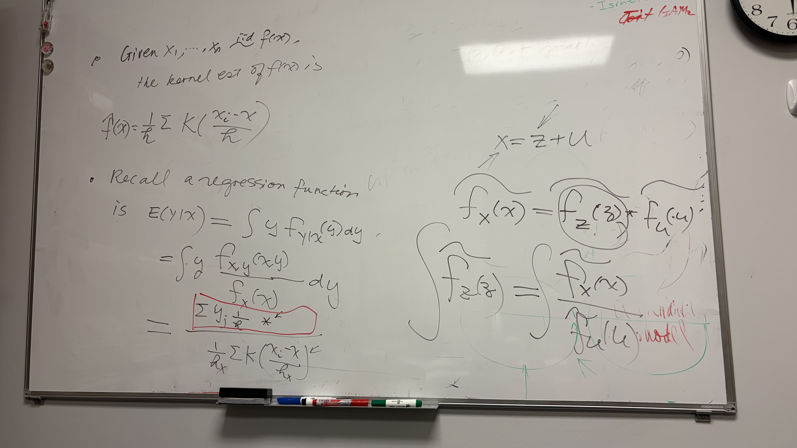

### Before
- 

### In Meeting
- 

### After
- think about y and theta as bi-variate case, then Bayesian is just special case
- estimation → regression, how? Hint: kernel estimation and kernel regression formula
- 