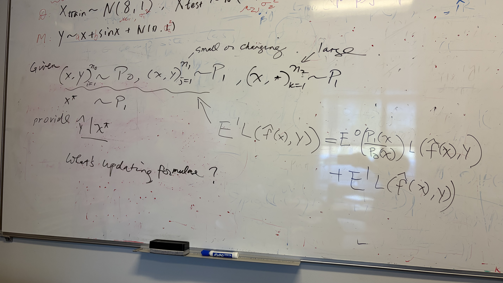

### Before
- 

### In Meeting
- 

### After
- gave the updated draft of CS_classification
- for DD
	- compare simulation under the setting of Tibshirani's paper (p8)
		- and maybe add additional random covariates, p=50?(p2)
	- for previous wrong case, add comparison with OLS, or plus some non-linear term, see if result is as what we expected?
	- ddl of STAI-X: May 11
	- poster?
- email Dr. Meyer?