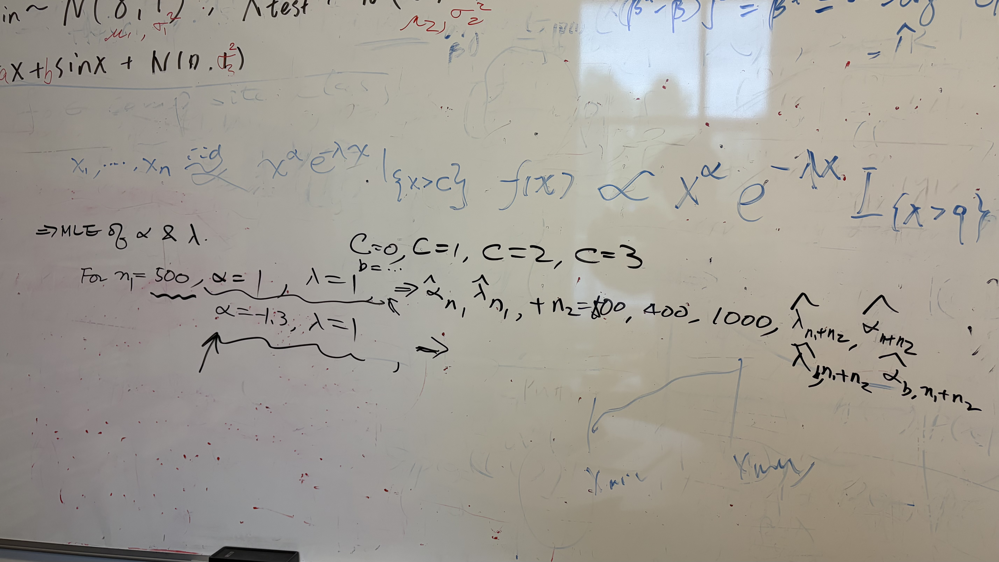

### Before
- 

### In Meeting
- 

### After
- STAI-X
- Ask Nathan for Dr. Meyer's "anchor" question
- Do more simulation: 
- $\lambda=1$, replication = 1000, $m=0$, estimated $\alpha=a+1$
- $\alpha=2 (a=1), n=100, c=2e-4$ 
- $\alpha=2 (a=1), n=100, c=2e-2$ 
- $\alpha=2 (a=1), n=100, c=2$ 
- $\alpha=2 (a=1), n=500, c=2e-4$ 
- $\alpha=2 (a=1), n=500, c=2e-2$ 
- $\alpha=2 (a=1), n=500, c=2$ 
- $\alpha=0.3 (a=-1.3), n=100, c=2e-4$ 
- $\alpha=0.3 (a=-1.3), n=100, c=2e-2$ 
- $\alpha=0.3 (a=-1.3), n=100, c=2$ 
- $\alpha=0.3 (a=-1.3), n=500, c=2e-4$ 
- $\alpha=0.3 (a=-1.3), n=500, c=2e-2$ 
- $\alpha=0.3 (a=-1.3), n=500, c=2$ 
- Also, when bias large, estimation of alpha goes better? (probably due to less observations around 0, and relatively more observations at tail end?)
- 